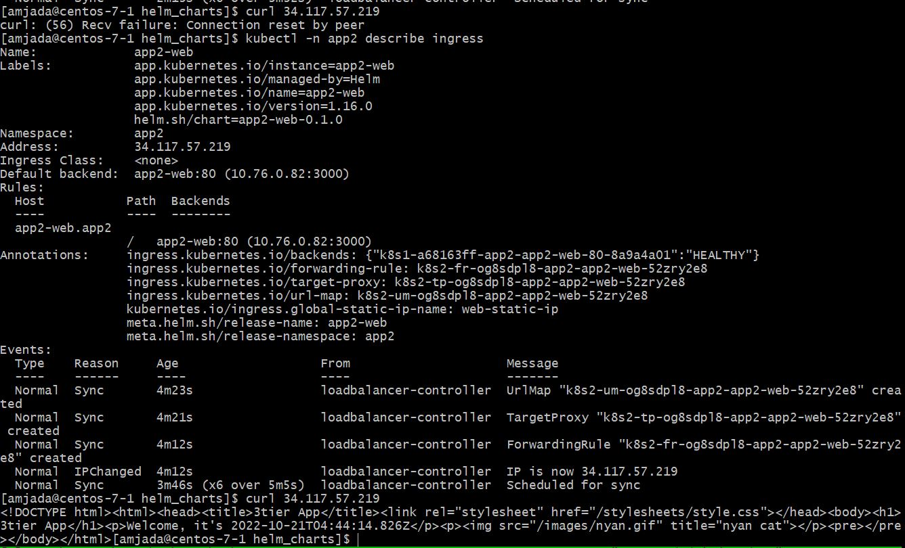
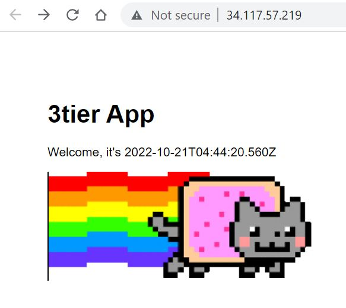

# helm_charts

#### here we can requests being "rotated" over the app2-api pods


#### describe ingress output


#### finally, some success


#### Commands to remember...
```

################################################################################
# HELM DEPLOYMENT
################################################################################
cd /home/amjada/amjada/helm_charts
#helm delete app2-ingress -n app2
#helm install -n app2 -f /home/amjada/amjada/helm_charts/app2-ingress/values.yaml app2-ingress /home/amjada/amjada/helm_charts/app2-ingress/

helm delete app2-api -n app2
helm install -n app2 -f /home/amjada/amjada/helm_charts/app2-api/values.yaml app2-api /home/amjada/amjada/helm_charts/app2-api/
helm upgrade -n app2 -f /home/amjada/amjada/helm_charts/app2-api/values.yaml app2-api /home/amjada/amjada/helm_charts/app2-api/

helm delete app2-web -n app2
helm install -n app2 -f /home/amjada/amjada/helm_charts/app2-web/values.yaml app2-web /home/amjada/amjada/helm_charts/app2-web/


kubectl -n app2 get pod
kubectl -n app2 describe pod
kubectl -n app2 get service
kubectl -n app2 describe service
kubectl -n app2 get ingress
kubectl -n app2 describe ingress

kubectl -n app2 logs
kubectl -n app2 exec -it xxx   -- bash

gcloud compute addresses create web-static-ip --global

gcloud compute addresses create web-static-ip --project silicon-pointer-146802 --region=northamerica-northeast2
gcloud compute addresses delete web-static-ip --project silicon-pointer-146802 --region=northamerica-northeast2

#https://cloud.google.com/kubernetes-engine/docs/how-to/cluster-access-for-kubectl
gcloud components install kubectl
gke-gcloud-auth-plugin --version
export USE_GKE_GCLOUD_AUTH_PLUGIN=True
gcloud container clusters get-credentials gke-toptal --zone=northamerica-northeast2-a
#--zone=northamerica-northeast2-a
#--region=northamerica-northeast2

```
