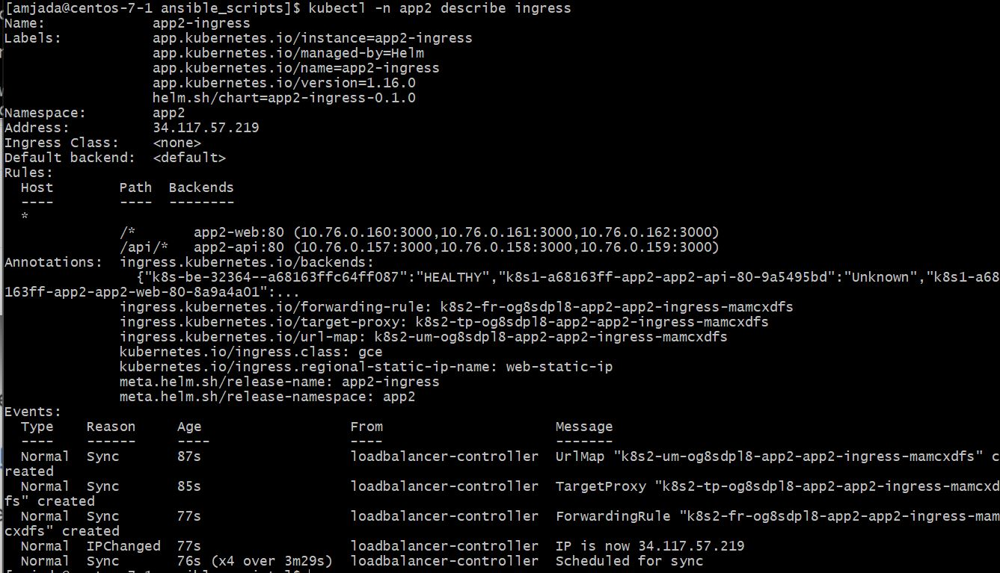
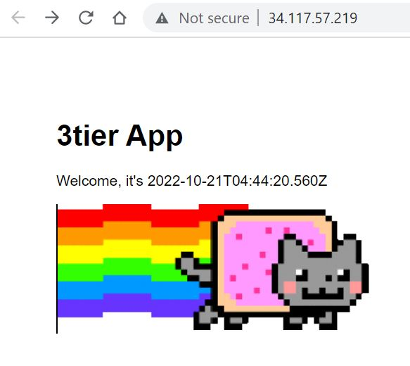

# helm_charts

#### here we can requests being "rotated" over the app2-api pods


#### describe ingress output


#### finally, some success


#### Commands to remember...
```

################################################################################
# HELM DEPLOYMENT
################################################################################
cd /home/amjada/amjada/node-3tier-app2/helm_charts
#helm delete app2-ingress -n app2
#helm install -n app2 -f /home/amjada/amjada/node-3tier-app2/helm_charts/app2-ingress/values.yaml app2-ingress /home/amjada/amjada/node-3tier-app2/helm_charts/app2-ingress/
helm upgrade -n app2 -f /home/amjada/amjada/node-3tier-app2/helm_charts/app2-ingress/values.yaml app2-ingress /home/amjada/amjada/node-3tier-app2/helm_charts/app2-ingress/

helm delete app2-api -n app2
helm install -n app2 -f /home/amjada/amjada/node-3tier-app2/helm_charts/app2-api/values.yaml app2-api /home/amjada/amjada/node-3tier-app2/helm_charts/app2-api/
helm upgrade -n app2 -f /home/amjada/amjada/node-3tier-app2/helm_charts/app2-api/values.yaml app2-api /home/amjada/amjada/node-3tier-app2/helm_charts/app2-api/ \
  --set .Chart.version=0.0.1

helm delete app2-web -n app2
helm upgrade -n app2 -f /home/amjada/amjada/node-3tier-app2/helm_charts/app2-web/values.yaml app2-web /home/amjada/amjada/node-3tier-app2/helm_charts/app2-web/


kubectl -n app2 get pod
kubectl -n app2 describe pod
kubectl -n app2 get service
kubectl -n app2 describe service
kubectl -n app2 get ingress
kubectl -n app2 describe ingress

kubectl -n app2 logs
kubectl -n app2 exec -it xxx   -- bash

gcloud compute addresses create web-static-ip --global

gcloud compute addresses create web-static-ip --project silicon-pointer-146802 --region=northamerica-northeast2
gcloud compute addresses delete web-static-ip --project silicon-pointer-146802 --region=northamerica-northeast2

#https://cloud.google.com/kubernetes-engine/docs/how-to/cluster-access-for-kubectl
gcloud components install kubectl
gke-gcloud-auth-plugin --version
export USE_GKE_GCLOUD_AUTH_PLUGIN=True
gcloud container clusters get-credentials gke-toptal --zone=northamerica-northeast2-a
#--zone=northamerica-northeast2-a
#--region=northamerica-northeast2

```

#### Helpful links...
https://www.digitalocean.com/community/tutorials/architecting-applications-for-kubernetes#implementing-readiness-and-liveness-probes<br />
Best Practices<br />
https://codefresh.io/docs/docs/new-helm/helm-best-practices/#chart-versions-and-appversions<br />
$SHORT_SHA : the first seven characters of COMMIT_SHA<br />
https://cloud.google.com/build/docs/configuring-builds/substitute-variable-values#using_default_substitutions<br />
ingress example<br />
https://cloud.google.com/kubernetes-engine/docs/how-to/load-balance-ingress#create-ingress<br />
multiple ingresses/paths<br />
https://www.reddit.com/r/kubernetes/comments/pt0q41/helm_ingress_template_for_multiple_ingressespaths/<br />
invalid ingress spec: service xxx is type "ClusterIP", expected "NodePort" or "LoadBalancer"
https://stackoverflow.com/questions/51572249/why-does-google-cloud-show-an-error-when-using-clusterip<br />
