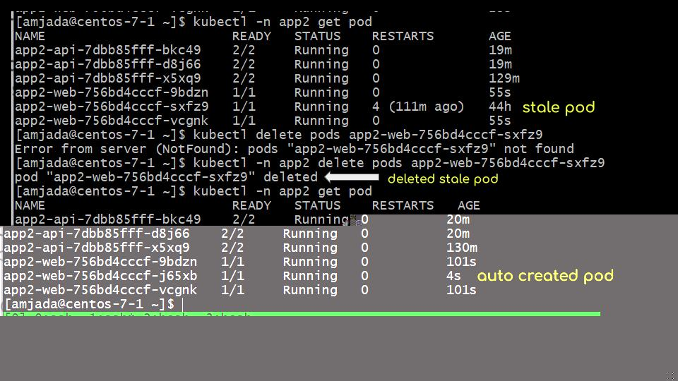
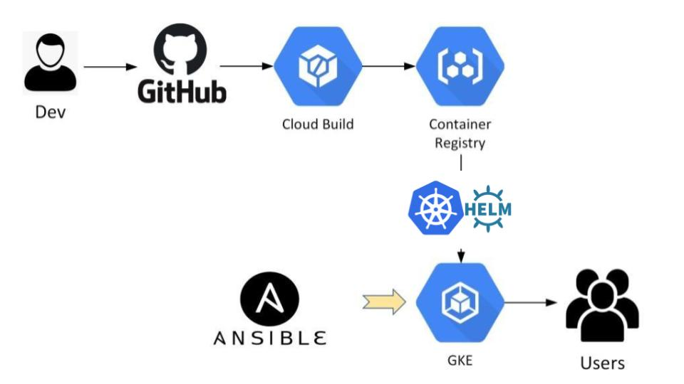

# amjada

req           | verified by developer?
------------- | -------------
web and api accessible publicly  | curl 34.117.57.219/ curl 34.117.57.219/api/status
database private  | 

resources for all tiers: cloud-sql and GKE   | 

IoC provisioning: [ansible_scripts](ansible_scripts) | 

server instance failures | 

update without downtime: liveness, readiness probes, rolling updates | 

automated deployment: google cloudbuild.yaml [node-3tier-app2](node-3tier-app2) | 

database backups: | 
log retention: | 
repository: [node-3tier-app2](node-3tier-app2) | 

Google Cloud was chosen due to existing account | 

---
#### standard kubernetes deployment service ingress

#### liveness and readiness probes

#### pod failure recovery

#### api -> cloudsql-proxy -> Private Network -> cloudsql

#### api -> Dev Architecture

